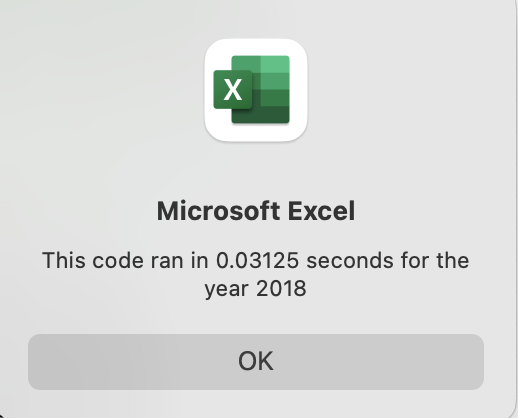
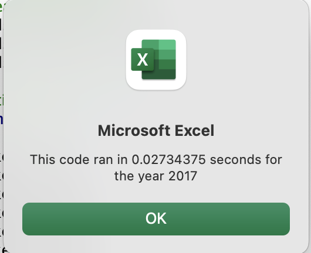
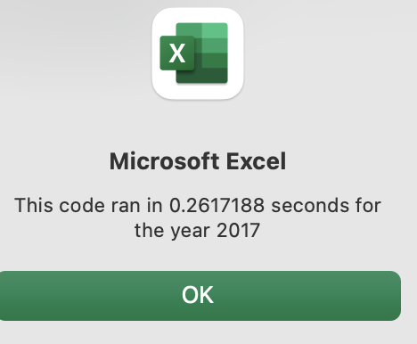
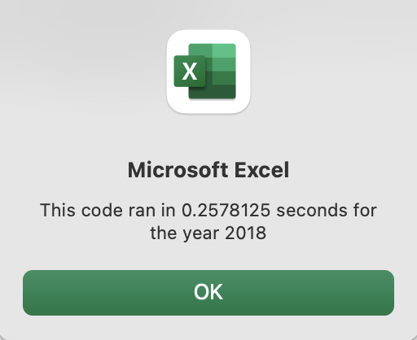

# Analysis on VBA-Refactored-Code 
## Overview of Project 
### Purpose and Background 
Steve, a client has multiple stocks that he would like to analyze. With the code from the module conducted it would take a longer time and many steps to analyze. Our purpose is to refactor or edit the existing code so that Steve can efficently analyze stocks and that code should require less steps, and avoiding the nested loops. 
## Results  
#### Code Run Times
The Refactored Code ran faster than the original code.  

2018 Refactored 0.03125  

2017 Refactored 0.027343  

2017 Original Code 0.2261718  

2018 Original Code 0.2578125 

#### Stock Results  
The stocks preformed overall well in 2017 with all but one a increase in return. The only stock that had a negative return was "TERP". However in 2018 only two stocks "ENPH" and "RUN" had an increase in return while all others were at a loss. 

## Summary 
### Advantages and Disadvantages on Refactoring Code 
### Advantages and Disadvantages of the Original and Refactored VBA script 
